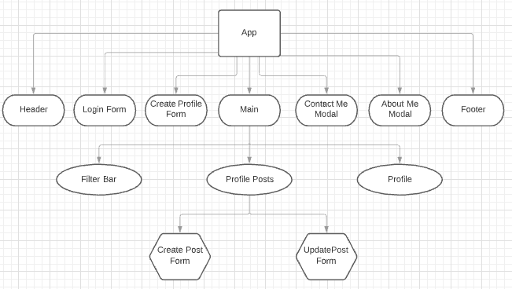
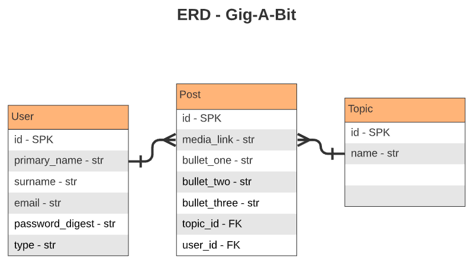

<br/>


- [Overview](#Gig-A-Bit)
- [MVP](#mvp)
  - [Goals](#goals)
  - [Libraries](#libraries)
  - [Client (Front End)](#client-front-end)
    - [Wireframes](#wireframes)
    - [Component Tree](#component-tree)
    - [Component Hierarchy](#component-hierarchy)
    - [Component Breakdown](#component-breakdown)
    - [Component Estimates](#component-estimates)
  - [Server (Back End)](#server-back-end)
    - [ERD Model](#erd-model)
- [Post-MVP](#post-mvp)
- [Code Showcase](#code-showcase)
- [Code Issues & Resolutions](#code-issues--resolutions)

# Gig-A-Bit

_The talent-board app for artistic individuals and small groups_
<br>

**Gig-A-Bit** allows registered users to create, edit and delete posts related to specific topics for the purpose of attracting talent-seekers.

The focus of the app is to provide a space for talent to post project ideas, work availability and portfolio work so talent-seekers can get in touch  and employ/collaborate with talent.

<br>

## MVP

- Content (JSX/HTML) and styling (CSS) resembling the wireframes presented.
- A RESTful 'React on Rails' app with three relational tables
- Homepage displaying all posts from all users
- All site visitors can filter through all posts and contact a user through their post
- Filter can be applied on the homepage and user profile
- User should be able to create a profile and/or log in
- Logged In user can create a new post, edit and/or delete their own published posts and no one elses
- Logged In user has access to their profile where they can only see their posts on their profile.
- GET, SHOW, POST, PUT, and DESTROY API data via front-end (view).
- Allow for posting of audio, video, img or gif

### Goals

Create a full-stack app with CRUD functionality and user authentication

### Libraries

|     Library          | Description                                |
| :--------------:     | :----------------------------------------- |
|      React           | _Javascript library used to develop the front-end (client)_  |
|   React Router       | _Used for establishing links and routes for front-end components_ |
|     Rails            | _Ruby library used to develop the back-end server/api_ |
|     Axios            | _Used to make http requests from the front end_ |
|  JSON Web Tokens     | _Used to encode and decode payload for user authentication_ |
|  Styled Components   | _Used for writing CSS in react components vs a seperate stylesheet _|
|   bcrypt             | _Used to hash passwords on the backend._|

<br>

### Client (Front End)

#### Wireframes

Desktop View (via whimsical)
- https://whimsical.com/UKCsKBa2VwiMM5dD1Eyuw4

Mobile View (via whimsical)
- https://whimsical.com/Mw2B2VeXv6PinJvpepggQs


#### Component Tree




#### Component Hierarchy
```
src
|__ assets/
      |__ reset.css
|__ components/
      |__ Header.jsx
      |__ FilterBar.jsx
      |__ MainContainer.jsx
      |__ Posts.jsx
      |__ LogIn.jsx
      |__ ProfileContainer.jsx
      |__ CreateProfile.jsx
      |__ CreatePost.jsx
      |__ UpdatePost.jsx
      |__ Footer.jsx
      |__ About.jsx
      |__ Contact.jsx
|__ services/
      |__ api-helper.js
      |__ auth.js
      |__ post.js
      |__ user.js
|__ App.jsx
|__ index.js

```

#### Component Breakdown


|  Component   |    Type    | state | props | Description                                                      |
| :----------: | :--------: | :---: | :---: | :--------------------------------------------------------------- |
|     App      |   class    |   y   |   n   | _Handles state for the logged in user-view/data ._               |
|    Header    | functional |   n   |   y   | _passed logged in user status as prop for dynamic nav btns._ |
|   FilterBar  | functional |   n   |   y   | _props passed from MainComponent. Filters posts by topic onClick._|
| MainContainer|   class    |   y   |   n   | _handles state for post data._                 |
|   Posts      | functional |   n   |   y   | _shows all posts. props from main_ |
|     LogIn    |   class    |   y   |   y   | _displays onChange event form for user login. Recieves props from App_ |
| ProfilePosts | functional |   n   |   y   | _Access only for logged in users. Recieves props from App and Main _   |
|    Footer    | functional |   n   |   n   | _Static component for About and Contact Links_ |
|   CreatePost    |   class    |   y   |   y   | _Needs props from App and Main_      |
|   CreateProfile  |   class    |   y   |   y   | _Needs props from App. State for onChange event form_      |
|   UpdatePost  |   class    |   y   |   y   | _Needs props from App and Main. State for onChange event form_      |

#### Component Estimates

| Task                               | Priority | Estimated Time | Time Invested | Actual Time |
| ---------------------------------- | :------: | :------------: | :-----------: | :---------: |
| Installing dependencies            |    H     |     15 mins    |     9 mins    |    9 mins   |
| App & Main.jsx                     |    H     |     5 hrs      |     1 hr      |    1 hr     |
| Header/Nav                         |    H     |     2 hrs      |     1.5 hrs   |    1.5 hrs  |
| Hamburger Menu                     |    L     |     3 hrs      |     2 hrs     |    2 hr     |
| Footer                             |    H     |     1 hrs      |     1 hr      |    1 hrs    |
| LogIn Modal                        |    H     |     2 hrs      |     3 hrs     |    3 hrs    |
| CreateProfile Modal                |    H     |     2 hrs      |     1.5 hrs   |    1.5 hrs  |
| Filter Bar                         |    L     |     3 hrs      |     1 hr      |    1 hr     |
| Logout function                    |    H     |     1 hrs      |     1 hr      |    1 hr     |
| Create Post                        |    H     |     3 hrs      |     9 hrs     |    9 hrs    |
| Update and Delete Post             |    H     |     3 hrs      |     3.5 hrs   |    3.5 hrs  |
| Map All Posts                      |    H     |     3 hrs      |     3 hrs     |    3 hrs    |
| Map All Profile Posts              |    H     |     4 hrs      |     2 hrs     |    2 hrs    |
| Server/API (schema)                |    H     |     1 hr       |     1 hr      |    1 hr     |
| Server/API (seed)                  |    H     |     .5 hr      |     1 hr      |    1 hr     |
| Server/API (users_controller)      |    H     |     1 hr       |     5 hrs     |    5 hrs    |
| Server/API (posts_controller)      |    H     |     .5 hrs     |    .5 hrs     |    .5 hrs   |
| Server/API (topic_controller)      |    H     |     .5 hrs     |     1 hr      |    1 hr     |
| Server/API (auth and app_controller)|   H     |     1 hr       |     4 hrs     |    4 hrs    |
| Server/API (custom routes)         |    M     |     .5 hrs     |     1.5 hrs   |    1.5 hrs  |
| Styling/Responsive Design          |    M     |     10 hrs     |     6 hrs     |    6 hrs    |
| TOTAL                              |    --    |    47 hrs      |     49.5 hrs  |   49.5 hr   |


<br>

### Server (Back End)

#### ERD Model



<br>

***

## Post-MVP

- search by user's name and location
- add more seeded topics
- make it so users have to test aptitude in topics in order to register or post on the topic
- restictions on number of posts per day related to the same topic and the similarity of previous posts to deter spamming.
- ability to register as a talent-seeker
- add favorites button for talent-seekers to save talent. 

***

## Code Showcase

- The below action is located in the posts controller on the backend. I used the Active Record .select, .join and .order methods to join my postgresql tables and customize an action for easier access to my API data when called on the frontend.

```
def posts_user_topic
  @posts = Post.joins(:user, :topic).select(
    "posts.id, 
    posts.media_link, 
    users.id AS user_id,
    users.primary_name, 
    users.surname,
    topics.id AS topic_id,
    topics.name AS topic_name,
    users.email, 
    posts.bullet_one, 
    posts.bullet_two, 
    posts.bullet_three,
    posts.created_at,
    posts.updated_at"
  ).order('posts.created_at DESC')
  render json: @posts
end

```

## Code Issues & Resolutions

> This section lists all major issues encountered and their resolution. There are currently no major issues.
