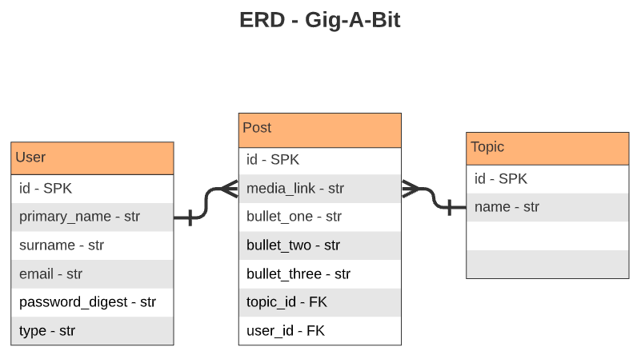

<br/>


- [Overview](#Gig-A-Bit)
- [MVP](#mvp)
  - [Goals](#goals)
  - [Libraries](#libraries)
  - [Client (Front End)](#client-front-end)
    - [Wireframes](#wireframes)
    - [Component Tree](#component-tree)
    - [Component Hierarchy](#component-hierarchy)
    - [Component Breakdown](#component-breakdown)
    - [Component Estimates](#component-estimates)
  - [Server (Back End)](#server-back-end)
    - [ERD Model](#erd-model)
- [Post-MVP](#post-mvp)
- [Code Showcase](#code-showcase)
- [Code Issues & Resolutions](#code-issues--resolutions)

# Gig-A-Bit

_The talent-board app for artistic individuals and small groups_
<br>

**Gig-A-Bit** allows registered users to create, edit and delete posts related to specific topics for the purpose of attracting talent-seekers.

The focus of the app is to provide a space for talent to post project ideas, work availability and portfolio work so talent-seekers can get in touch  and employ/collaborate with talent.

<br>

## MVP

- Content (JSX/HTML) and styling (CSS) resembling the wireframes presented.
- A RESTful 'React on Rails' app with 
- Accessible regional detail page
- Accessible country detail pages via randomly generated result and via the regional detail page.
- GET API data on total statistics from all countries ('world data' -Home pg), total stats per region ('region details' -region pg.), and country stats (-country pg.).

_The **Project Title** MVP lorem ipsum dolor sit amet, consectetur adipiscing elit. Phasellus dapibus fermentum risus vitae bibendum. Integer vel ipsum mollis odio sollicitudin ornare eu vel ex. In quis fringilla velit, ac maximus quam. Etiam eget placerat neque. Aenean faucibus sem non nisi lobortis ullamcorper._

<br>

### Goals

- _Lorem ipsum, dolor sit amet,_
- _consectetur adipiscing elit._
- _Phasellus dapibus fermentum risus vitae bibendum._
- _Integer vel ipsum mollis odio sollicitudin ornare eu vel ex._
- _etc._

<br>

### Libraries

> Use this section to list all supporting libraries and dependencies, and their role in the project.

|     Library      | Description                                |
| :--------------: | :----------------------------------------- |
|      React       | _Lorem ipsum dolor sit amet, consectetur._ |
|   React Router   | _Lorem ipsum dolor sit amet, consectetur._ |
| React SemanticUI | _Lorem ipsum dolor sit amet, consectetur._ |
|     Express      | _Lorem ipsum dolor sit amet, consectetur._ |
|  Express Router  | _Lorem ipsum dolor sit amet, consectetur._ |

<br>

### Client (Front End)

#### Wireframes

> Desktop and Mobile views.


Desktop View (via whimsical)
- https://whimsical.com/UKCsKBa2VwiMM5dD1Eyuw4

Mobile View (via whimsical)
- https://whimsical.com/Mw2B2VeXv6PinJvpepggQs


#### Component Tree

> Use this section to display the structure of how your React components are being rendered. This should show the parent to child relation between you components. In other words, show which components are rendering the other components. 

#### Component Hierarchy

> Use this section to define your React components and the data architecture of your app. This should be a reflection of how you expect your directory/file tree to look like. 

``` structure

src
|__ assets/
      |__ fonts
      |__ graphics
      |__ images
      |__ mockups
|__ components/
      |__ Header.jsx
|__ services/

```

#### Component Breakdown

> Use this section to go into further depth regarding your components, including breaking down the components as stateless or stateful, and considering the passing of data between those components.

|  Component   |    Type    | state | props | Description                                                      |
| :----------: | :--------: | :---: | :---: | :--------------------------------------------------------------- |
|    Header    | functional |   n   |   n   | _The header will contain the navigation and logo._               |
|  Navigation  | functional |   n   |   n   | _The navigation will provide a link to each of the pages._       |
|   Gallery    |   class    |   y   |   n   | _The gallery will render the posts using cards in flexbox._      |
| Gallery Card | functional |   n   |   y   | _The cards will render the post info via props._                 |
|    Footer    | functional |   n   |   n   | _The footer will show info about me and a link to my portfolio._ |

#### Component Estimates

> Use this section to estimate the time necessary to build out each of the components you've described above.

| Task                | Priority | Estimated Time | Time Invested | Actual Time |
| ------------------- | :------: | :------------: | :-----------: | :---------: |
| Add Contact Form    |    L     |     3 hrs      |     2 hrs     |    3 hrs    |
| Create CRUD Actions |    H     |     3 hrs      |     1 hrs     |     TBD     |
| TOTAL               |          |     6 hrs      |     3 hrs     |     TBD     |

> _Why is this necessary? Time frames are key to the development cycle. You have limited time to code your app, and your estimates can then be used to evaluate possibilities of your MVP and post-MVP based on time needed. It's best you assume an additional hour for each component, as well as a few hours added to the total time, to play it safe._

<br>

### Server (Back End)

#### ERD Model



<br>

***

## Post-MVP

> Use this section to document ideas you've had that would be fun (or necessary) for your Post-MVP. This will be helpful when you return to your project after graduation!

***

## Code Showcase

> Use this section to include a brief code snippet of functionality that you are proud of and a brief description.

## Code Issues & Resolutions

> Use this section to list of all major issues encountered and their resolution, if you'd like.
